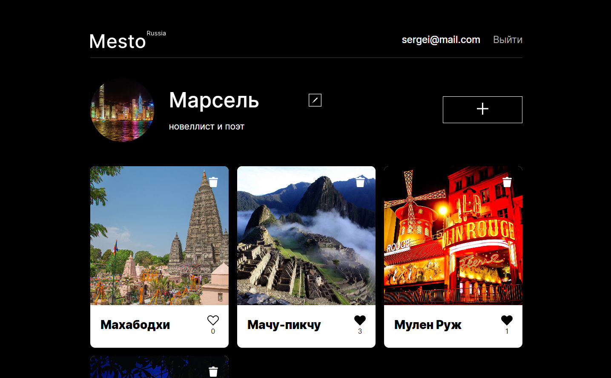

# 👨🏻‍💻 Mesto

___
## ✨ Введение:

Проект Mesto - это модель социальной сети, где пользователи выкладывают свои фотографии достопримечательностей
и ставят лайки. Реализована front-end часть на React.js и back-end часть на Node.js


*Главная страница*

___

## 🌐 Ссылки на домейны проекта:
Приложение выложено на платформе Vercel, back-end часть использует удаленную базу данных Mongo.

### ⚛️ Frontend часть: https://mesto-react-frontend.vercel.app 
### ⚙️ Backend часть: https://mesto-react-api.vercel.app
### ✍️Репозиторий Backend части: https://github.com/Andrey-Grishkov/mesto-react-api

___

<h3 align="left">🧙‍♂️ Реализованные функции</h3>

* Регистрация, авторизация и выход пользователя из аккаунта
* Редактирование аватара, имени, описание о пользователе 
* Валидация вводимых данных
* Добавление, удаление своих карточек с фотографиями
* Открытие попапа с увеличенной фотографией при нажатии на карточку
* Добавление, удаление лайка на карточке. Счетчик лайков
* Попапы с уведомлениями
* Адаптивная верстка с использованием Flexbox и Grid Layout
* Хуки useState и useEffect

___

### 🛠️ Технологии:


  


  


___

### 🚀 Инструкция по запуску на локальной машине:
* Установить [Node.js](https://nodejs.org/ru/)
* Клонировать репозиторий ``` git clone git@github.com:Andrey-Grishkov/mesto-react-frontend.git```
* Установить зависимости ``` npm install ```
* Запустить приложение ``` npm run start ```
